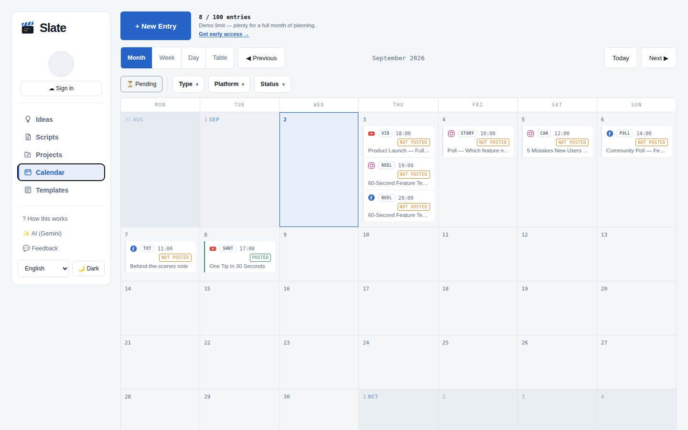
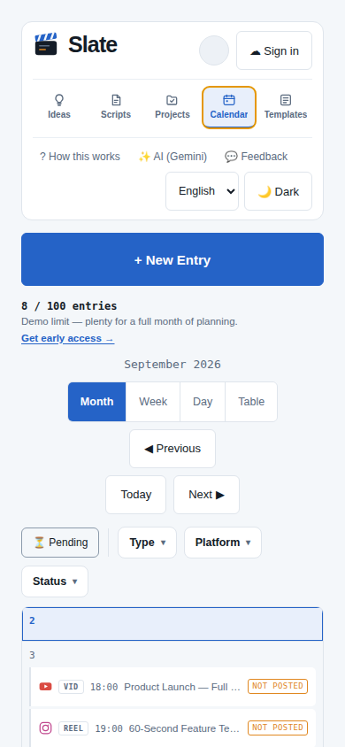

# Slate: Satılabilirlik ve Pazar Araştırması

**Tarih:** 2 Eylül 2026
**Konu:** https://gerceginizleritv.github.io/content-calendar-demo/ adresindeki Slate uygulaması satılabilir mi, içerik üreticilerinin böyle bir araca ihtiyacı var mı, pazar oluşturulabilir mi?
**Yöntem:** Kod tabanı ve hafıza dosyası incelendi; uygulamanın ekran görüntüleri alındı; üç paralel araştırma koluyla yaklaşık 160 web araması yapıldı (rakipler ve fiyatlar, talep sinyalleri, iş modeli ve Türkiye'den satış); vidIQ'dan YouTube arama hacmi çekildi; GitHub üzerinden resmî dokümantasyon kaynakları (GitHub Pages, Supabase, Polar, Gumroad, Dodo Payments, Obsidian) doğrudan okundu.
**Sınırlılık:** Oturumun ağ kısıtı yüzünden satıcı siteleri, inceleme siteleri ve Reddit doğrudan açılamadı. Fiyatlar 2026 tarihli üçüncü taraf fiyat takipçilerinden alındı ve mümkün olduğunda iki kaynakla çaprazlandı. Her bilginin yanında güven işareti var: **[D]** doğrudan doğrulandı, **[Ö]** yalnızca arama özeti görüldü, **[B]** belirsiz veya çelişkili.

---

## 0. Kısa cevap

**1. Benim gibi içerik üreticilerinin böyle bir araca ihtiyacı var mı?**
İhtiyaç gerçek ve büyük; "içerik takvimi" aramaları YouTube'da ayda on binlerce, Notion tabanlı içerik takvimi aramaları tek başına ayda 47 bin ve hızla artıyor. Ancak üreticilerin ezici çoğunluğu bu ihtiyacı bugün ücretsiz araçlarla (Notion, Google Sheets, Excel, Meta Business Suite, artık ChatGPT) karşılıyor. "Planlayan ama yayınlamayan uygulama" için para ödeyen segment dar ama var: yapılandırılmış bir üretim sistemi arayan video üreticileri. Bu segmentin para verdiğinin kanıtı Thomas Frank'in 149 ile 199 dolarlık Creator's Companion Notion sistemidir.

**2. Pazar oluşturabilir miyim?**
Sıfırdan pazar yaratmak gerekmiyor ve mümkün de değil; "içerik takvimi" pazarı kalabalık ve ucuz. Yapılabilecek şey, var olan pazarda tanımlı bir niş almak: **çekim yapan video üreticileri (belgesel, saha, seyahat, vlog, yerel haber) ve 1 ile 3 kişilik prodüksiyon ekipleri için üretim planlama panosu.** Bu nişte Slate'in "bir çekim, on paylaşım" modeli ve fikir → script → proje → takvim zinciriyle birebir örtüşen bir rakip bulunamadı. Buffer, Later ve Metricool'la rekabet edilmemeli; rakip Notion şablonları ve Google Sheets.

**3. Uygulamayı satabilir miyim?**
- *Ürün olarak (abonelik veya lisans):* Evet, denenebilir ve denenmeli; ama gerçekçi beklenti küçük ölçek. Tek kişilik, sıfır bütçeli benzer ürünlerde gerçekçi hedef 6 ile 12 ayda aylık 200 ile 1.000 dolar; niş liderliğine ulaşan azınlık aylık 3 ile 5 bin dolara çıkıyor. Bu ölçek tam zamanlı gelir değil, ek gelir.
- *Kodu veya şirketi satmak:* Şu anda değeri yok denecek kadar az. Gelirsiz projeler pazar yerlerinde 1 ile 5 bin dolar arasında el değiştiriyor; Acquire.com doğrulanabilir gelir olmadan listeleme yapılmamasını öneriyor. Değer ancak ödeyen kullanıcı, trafik ya da dağıtım kanalı (kendi kanalınız) ile oluşur.

**Öneri:** Satıp satamayacağınızı tahminle değil parayla öğrenin. 90 günlük, neredeyse sıfır maliyetli bir doğrulama planı 11. bölümde. Karar eşiği: gerçek bir fiyat sayfasından **en az 10 ön sipariş**. Bu eşik geçilirse ürünleşme (10. bölüm), geçilmezse ürün kişisel araç ve kanal içeriği olarak kalır; ikisi de kayıp değil.

**Satıştan önce zorunlu dokuz iş** (10. bölüm): yeniden adlandırma, barındırmayı GitHub Pages'tan taşıma, Supabase Pro, karşılama ve fiyat sayfası, ödeme altyapısı (Polar veya Dodo), kullanım şartları, hesabı kendi kendine silme, mobilde takvimin katlanması, testlerin depoya alınması. Toplam 1 ile 2 hafta.

---

## 1. Ürün: Slate ne, kimin için, hangi durumda

**Tek cümle.** Slate, "bir çekim, on paylaşım" fikrini merkeze alan ve yayın yapmayan bir içerik planlama panosu. Zincir şu: Fikir → Script → Proje (yedi üretim adımı, adım başına termin, çekim yeri, izin, saha notu) → Takvim (tür ve platform iki ayrı etiket; her paylaşımın kendi açıklaması, kapak yazısı, saati ve saat dilimi).

**Koddan okunan teknik durum (2 Eylül 2026):**

| Konu | Durum |
|---|---|
| Kod tabanı | Tek HTML dosyası, yaklaşık 9.900 satır, saf JavaScript. 503 KB ham, 144 KB sıkıştırılmış. |
| Barındırma | GitHub Pages (statik). Sunucu yok. Aylık maliyet sıfır. |
| Veri | Varsayılan olarak tarayıcıda (localStorage). İsteğe bağlı hesap: Supabase (e-posta bağlantısı veya Google). Çevrimdışı kuyruk, silmede mezar taşı, "yeni olan kazanır" çakışma kuralı. |
| Güvenlik | Bütün tablolarda satır düzeyi güvenlik (RLS) politikası var; kullanıcı yalnızca kendi satırını görüyor. |
| AI | Kullanıcının kendi Gemini anahtarı (BYOK). Anahtar tarayıcıda kalıyor, istek doğrudan Google'a gidiyor. Model listesi anahtara göre süzülüyor, yedek modeller var. Script, başlık, açıklama ve kapak yazısı üretiyor. |
| Entegrasyon | Google Drive'dan script getirme ve geri yazma. Otomatik yayın yok (bilinçli karar). |
| Ölçüm ve geri bildirim | GoatCounter (çerezsiz sayım) ve huni olayları kodda hazır. Web3Forms ile geri bildirim formu; e-posta alanı "erken erişim" listesi topluyor. |
| Demo sınırı | 100 kayıt, 100.000'e kadar hesaptan yükseltilebiliyor. "Erken erişim iste" düğmesi takvimin üstünde. |
| Dil ve tema | İngilizce ve Türkçe (273 anahtar, ikisi de tam). Açık ve koyu tema. |
| Mobil | PWA manifesti var, ana ekrana eklenebiliyor. Service worker henüz yok; çevrimdışı açılış ve bildirim bu yüzden yok. |
| Test | Hafıza dosyasında altı Playwright testi anılıyor, ancak depoda test dosyası yok (yerelde duruyor). |
| Gizlilik | Sade, dürüst bir gizlilik sayfası var. Takip çerezi yok. |
| Hız | 1 ile 3 Eylül arasında 50 commit. Geliştirme Claude ile yapılıyor; hafıza dosyası kararların gerekçesini tutuyor. |

**Ekran görüntülerinden gözlemler.** Masaüstünde arayüz temiz ve profesyonel görünüyor: takvimde platform simgesi, tür etiketi (VID, REEL, STORY, CAR, POLL, TXT, SHRT) ve durum rozeti bir bakışta okunuyor; on adımlı tur çizimleri kaliteli. Telefonda ise takvim ızgarası ekranın altına düşüyor: üst şerit, "Yeni Giriş" düğmesi, demo notu, görünüm seçici, gezinme ve filtreler ilk 690 pikseli dolduruyor, ilk kayıt ancak kaydırınca görünüyor. İçerik üreticilerinin büyük kısmı telefondan çalıştığı için bu, satış öncesi düzeltilecek ilk maddelerden biri.

### 1.1 Slate'i farklı kılan şeyler

1. **Üretim odaklı model.** Rakiplerin neredeyse tamamı "paylaşım" odaklı: bir gönderi yaz, tarih ver, yayınla. Slate "çekim" odaklı: bir proje açılıyor, script'i, çekimi, sesi, kurgusu, onayı, paketlemesi ve yayını ayrı ayrı takip ediliyor, sonra o çekimden çıkan on paylaşım takvime dağılıyor. Bu, video üreten (YouTube, belgesel, vlog, saha) kişilerin gerçek iş akışı.
2. **Tür ve platform ayrı etiket.** Aynı çekim Instagram'da Reel, YouTube'da Short olarak çıkıyor. Çoğu araç bunu ya iki ayrı gönderi olarak ya da tek platform kutusuyla çözüyor.
3. **Yayınlamıyor.** Bu bir eksik gibi görünüyor ama ürünün en ucuz ve en dayanıklı tarafı: platform API onayı yok, API değişince kırılmıyor, kanal başına ücret yok, hesap bağlama korkusu yok. YouTube'a yükleme zaten elle yapılıyor; Reels ve TikTok'ta trend ses seçmek için uygulamadan paylaşmak gerekiyor. Yani "planla, kendin yayınla" akışı zaten pek çok üreticinin yaşadığı gerçek.
4. **Kendi anahtarınla AI.** Ürün sahibine sıfır maliyet, kullanıcıya gizlilik. Gemini'nin ücretsiz anahtarı kredi kartı istemiyor.
5. **Önce yerel, sonra bulut.** Hesap açmadan çalışıyor; hesap açınca cihazlar arası eşitleniyor. Bu, Obsidian'ın kanıtladığı "uygulama ücretsiz, eşitleme ücretli" modeline doğal olarak uyuyor.
6. **Sıfıra yakın işletme maliyeti.** Ürün, az sayıda ödeyen kullanıcıyla bile zarar etmeden yaşayabilir. Bu, yatırımcı arayan bir girişim için önemsiz ama tek kişilik bir iş için hayati bir avantaj.
7. **Gerçek bir ihtiyaçtan çıktı.** Kurucu ile pazar uyumu (founder-market fit) var: ürünü yapan kişi hedef kullanıcının kendisi ve 112 gerçek yayın kaydıyla kendi işinde kullanıyor.

### 1.2 Satış önünde duran zayıflıklar

1. **"İsim" sorunu.** "Slate" adı, içerik üretimi kategorisinde başka bir şirket tarafından kullanılıyor: Slate (slateteams.com), spor takımları ve markalar için gerçek zamanlı sosyal medya içerik üretim uygulaması. Bu oturumda ağ engeli yüzünden site doğrulanamadı; satış öncesi marka araması (TÜRKPATENT ve EUIPO/USPTO) ve yeniden adlandırma şart. Ayrıca "Slate" adı Slate dergisi, Slate Digital ve Slate.js ile de çakışıyor; alan adı ve arama görünürlüğü zor olacak.
2. **Barındırma sözleşmesi.** GitHub Pages kuralları, ticari SaaS için kullanımı yasaklıyor (ayrıntı 9. bölümde). Para alınmaya başlandığı gün Cloudflare Pages, Netlify veya Vercel'e taşınmalı; taşınma teknik olarak birkaç saatlik iş.
3. **Supabase ücretsiz katman.** Bir hafta hareketsizlikte proje duraklıyor, yedek yok. Ödeyen ilk kullanıcıyla birlikte Pro plan (aylık 25 dolar) gerekir; bu, ürünün ilk sabit gideri.
4. **API anahtarı sürtünmesi.** Teknik olmayan bir üretici için "API anahtarı al, yapıştır" adımı ürünün en büyük terk noktası olacak. Rehber ve doğrulama yapılmış; yine de ücretli pakette AI'nın ürün tarafından karşılanması dönüşümü artırır.
5. **Yayınlamama beklentisi.** "İçerik takvimi" arayan kişinin zihnindeki varsayılan ürün Buffer ya da Later. Slate'in "yayınlamıyor" olması, konumlandırmada baştan ve açıkça söylenmezse hayal kırıklığı üretir.
6. **Mobil deneyim.** Yukarıdaki katlanma sorunu, service worker eksikliği, bildirim yokluğu.
7. **Tek kişilik bakım.** Tek dosya yapısı hızlı ama büyüdükçe kırılgan; iki dilde bakım her özelliği iki kez yazdırıyor. Ürün sahibinin asıl işi içerik üretmek; ürün zamanla yarışıyor.
8. **Niş alanlar geniş kitleye yabancı.** Çekim yeri, izin, saha notu gibi alanlar belgeselci ve saha çekimi yapan üretici için değerli; masa başı üreticisi (podcast, tasarım, yazı) için gürültü. Katlanmış ve isteğe bağlı olmaları bu riski azaltıyor ama pazarlama mesajı buna göre seçilmeli.

---

## 2. Pazarın büyüklüğü ve üreticilerin ödeme gücü

| Bulgu | Kaynak | Güven |
|---|---|---|
| Üretici ekonomisi 250 milyar dolar; 2027'de yaklaşık 480 milyar dolar; 50 milyon üretici, yılda %10 ile 20 büyüme | Goldman Sachs, Nisan 2023 | [Ö] |
| Dünyada 200 milyon üretici (Linktree tanımı); 303 milyon (Adobe, 2022) | Linktree Creator Report 2023; Adobe Future of Creativity 2022 | [Ö] |
| Üreticilerin %66'sı yarı zamanlı. Tam zamanlıların yalnızca %12'si yılda 50 bin dolardan fazla, %46'sı yılda 1.000 dolardan az kazanıyor | Linktree, yaklaşık 9.500 üreticiyle anket, 2022 | [Ö] |
| Üreticilerin %59'u kendini girişimci olarak tanımlıyor (önceki yıl %50); platformların öngörülemezliğinden bir önceki yıla göre iki kat daha fazla endişeli | Kajabi State of Creator Commerce, Nisan 2025 | [Ö] |
| ABD'de tam zamanlı üreticinin medyan geliri 44 bin dolar (2025); yarı zamanlı 5 bin doların altında | Kit State of the Creator Economy (alıntı) | [B] |
| Küresel influencer pazarlaması 2025'te yaklaşık 32,5 milyar dolar | Influencer Marketing Hub (alıntı) | [Ö] |
| Üreticilerin planlama/zamanlama yazılımına ne harcadığına dair 2024 ile 2026 arası anket verisi | Bulunamadı | [B] |

**Anlamı.** Kitle devasa, ama medyan gelir çok düşük: üreticilerin büyük kısmı bir yazılıma ayda 10 dolar vermeden önce iki kez düşünür. Para veren dilim, kendini "girişimci" olarak gören ve içeriği bir iş gibi yöneten azınlık. Slate'in hedef kitlesi tam olarak bu dilim: birden fazla platforma düzenli üretim yapan, çekim planlayan, termin takip eden üretici.

---

## 3. Talep sinyalleri

### 3.1 YouTube'da arama talebi (vidIQ verisi, 2 Eylül 2026)

vidIQ anahtar kelime aracıyla "content calendar" tohumundan çekilen tahmini aylık YouTube arama hacimleri (küresel):

| Anahtar kelime | Tahmini aylık arama | 30 günlük tabana göre değişim |
|---|---|---|
| notion content calendar | 47.568 | +243 % |
| content calendar for social media | 22.791 | −52 % |
| content calendar notion | 11.848 | −22 % |
| content calendar | 11.768 | −59 % |
| how to create a content calendar | 8.977 | 0 % |
| how to create a content calendar for social media | 8.772 | −62 % |
| social media content calendar | 7.729 | 0 % |
| how to make a content calendar | 4.891 | veri yok |
| notion content calendar template | 4.555 | veri yok |
| content calendar planning | 4.466 | veri yok |
| content calendar template | 4.321 | veri yok (rekabet puanı 9,7: düşük) |
| airtable content calendar | 4.175 | veri yok |
| social media calendar | 3.954 | veri yok |

Türkiye içi hacim: bu terimlerin hiçbiri Türkiye'de ölçüm eşiğini (ayda 750 arama) geçmiyor; yalnızca "social media marketing" Türkiye'de ayda yaklaşık 4.800 arama alıyor. Türkçe "içerik takvimi" terimi bu oturumda ölçülemedi (araç kredisi bitti).

**Bu tablodan çıkan üç sonuç.**
1. "İçerik takvimi nasıl yapılır" konusunda gerçek ama ılımlı bir eğitim talebi var; toplamda ayda on binlerce arama, ancak dalgalı (taban değerlere göre yarı yarıya düşüşler görülüyor).
2. En güçlü ve en hızlı büyüyen niyet **Notion tabanlı** içerik takvimi: insanlar kendilerine ait, esnek ve ucuz bir yapı istiyor, hazır SaaS'a abone olmak istemiyor. Bu, Slate için hem uyarı (ücretsiz alternatif çok güçlü) hem de fırsat (Notion şablonu satın alan kitle, aynı işi daha az kurulumla yapan hazır bir uygulamaya para veriyor).
3. Bu terimlerin Türkiye hacmi ihmal edilebilir düzeyde. Türkiye, ürün için "ilk topluluk" olabilir ama "pazar" olamaz; gelir İngilizce konuşan pazardan gelmeli.

Talep araştırma kolunun aynı araçla genişlettiği tablo (küresel, aylık tahmini YouTube araması, 2 Eylül 2026) [D]:

| Anahtar kelime | Aylık arama | Not |
|---|---|---|
| content planning | 30.513 | ABD içi 10.048 |
| content repurposing | 28.623 | +71 %; "bir çekim, on paylaşım" niyetinin ta kendisi |
| youtube workflow | 24.181 | +387 % |
| notion for content creators | 22.949 | |
| content calendar google sheets | 21.423 | |
| content planner | 16.831 | +241 % |
| repurposing content | 10.009 | +85 % |
| how to create a content calendar for social media with chatgpt | 9.375 | AI ile üretilen takvimler |
| how to make a content calendar in notebooklm | 7.211 | |
| youtube video planner | 5.397 | |
| how to make content calendar in meta business suite | 5.341 | platformun kendi aracı |
| youtube content calendar | 3.905 | |
| youtube planning tools | 750'nin altında | "araç" arayan neredeyse yok |
| content planner app | 750'nin altında | |

Türkiye içi (aynı araç): "içerik takvimi", "sosyal medya takvimi", "sosyal medya planlama", "içerik planlama", "youtube içerik planlama" ve "içerik planlayıcı" terimlerinin hepsi ayda 750 aramanın altında. Buna karşılık "instagram içerik planlama" yaklaşık 5.000, "sosyal medya yönetimi" yaklaşık 28.400 (+85 %), "youtube para kazanma" yaklaşık 118.000. Türk üreticiler "nasıl planlarım" değil "nasıl kazanırım" diye arıyor.

### 3.2 Kullanıcıların sesi

Reddit ve forum sayfaları bu oturumda açılamadığı için birebir alıntılar sınırlı; aşağıdakiler arama özetlerinden ve doğrudan okunabilen GitHub kayıtlarından.

**Kendin yap araçları baskın.** İnsanlar "uygulama" değil "sistem" arıyor: Notion, Google Sheets, Excel ve artık ChatGPT/NotebookLM/Claude ile üretilen takvimler. Spreadsheet Point'in sayfa başlığı durumu özetliyor: *"You don't need a $40/month scheduling tool. You need this free Google Sheets calendar."* [Ö]. Hootsuite bile bireyler için Notion ve Trello'nun yeterli olduğunu yazıyor [Ö]. Buffer'ın 2026 öngörü yazısı: *"2025'te işin daha büyük kısmı üçüncü taraf araçlar yerine platformların içinde yapıldı."* [Ö]

**Fiyat kaynaklı kaçış gerçek.** Later 2024'te ücretsiz planını kaldırdı, giriş fiyatı ayda 25 dolar; X desteğini yıllık abonelik ortasında bıraktı; Trustpilot puanı 1,3 [Ö]. Buffer'da kanal başına fiyat "acı verici şekilde büyüyor" [Ö]. Hootsuite ücretsiz planı 2023'te kaldırdı, giriş fiyatı 5,99 dolardan 99 dolara çıktı [Ö]. Ama kaçanlar ücretli planlama araçlarına değil, Buffer ve Metricool'un ücretsiz katmanlarına gidiyor.

**"Yayınlamayan planlayıcı" bir kitle bulmuş.** Instagram için Preview uygulaması "15 milyondan fazla" kullanıcı iddiasıyla yalnızca görsel planlama satıyor; "Instagram'a giriş yapmadan" planlama vaat eden rakipleri var [Ö]. Yani yayın yapmayan planlayıcının pazarda yeri var; ancak bu, görsel ızgara planlaması için kanıtlanmış, üretim planlaması için henüz değil.

**Zamanlayıcı kullanıcıları daha az değil daha çok otomasyon istiyor.** Postiz'in (35.400 yıldızlı açık kaynak zamanlayıcı) sorun kayıtlarında "sadece planlayayım, yayınlamayayım" diye tek bir istek yok; istenenler otomatik yanıt, hazır yayın programı, hikâyeye paylaşma, Reels yayını [D]. Seçim yanlılığı var (zamanlayıcı kullananlar zamanlama için gelmiş), ama uyarıcı.

**Slate'in ayrıntı kararları gerçek acılara denk geliyor.** Aynı sorun kayıtlarında 2025 ile 2026 arasında dört ayrı saat dilimi ve yaz saati hatası ("planlanan gönderiler bir saat kayıyor"), Reels kapak görseli istekleri ve "içeriği platformlar arasında yeniden kullanmak zaman alıyor" şikâyetleri var [D]. Slate'in kayıt başına saat dilimi, kapak yazısı ve çoğaltma özellikleri bunlara cevap.

**Kendi anahtarınla AI'yı isteyen bir kitle var, ama teknik kitle.** Postiz'i kendi sunucusuna kuranlar "OpenAI anahtarım var ama yeni AI özelliklerini göremiyorum" diye şikâyet ediyor [D]. BYOK talebi geliştiricilerden ve kendi sunucusunu kuranlardan geliyor, Instagram üreticilerinden değil.

### 3.3 Şablon ekonomisi: planlama için para ödeniyor

| Kanıt | Kaynak | Güven |
|---|---|---|
| Thomas Frank'in Notion şablonları 2022'de 1 milyon doları geçti, iki yılda yaklaşık 2,1 milyon dolar. Creator's Companion (fikir → araştırma → script → yayın takvimi → performans → marka anlaşmaları) katmanları: temel 17 bin, Ultimate Tasks 86 bin, paket 298 bin dolar (kendi beyanı) | typefully.com/TomFrankly; starterstory.com | [Ö] |
| Easlo 2022'de 239 bin, 2024'te tahminen 779 bin dolar şablon satışı; bir şablonu 79 dolardan 979 alıcı | getlatka.com | [Ö] |
| Pascio üç yılda 250 binden fazla şablon, 275 bin dolardan fazla gelir | pascio.gumroad.com | [Ö] |
| Gumroad'daki içerik takvimi şablonları 1,70 ile 39 dolar arası; Etsy'de bir Google Sheets takvimi 4,8 yıldız ve 716 yorum | gumroad.com; etsy.com | [Ö] |
| Thomas Frank'in ücretsiz "Notion Video Project Tracker"ı: YouTuber'lar için ana tablo, kurgu ve yayın kontrol listeleri, script sayfaları, B-roll tablosu | thomasjfrank.com | [Ö] |

**Anlamı.** Üreticiler planlama yapısı için para ödüyor; ama ödedikleri şey ya bir ünlü üreticinin kitlesine satılan pahalı sistem (149 ile 199 dolar) ya da 10 ile 25 dolarlık tek seferlik şablon. Slate'in fiyat çıpası Buffer'ın 29 doları değil, bu iki uç.

### 3.4 Türk üreticilerin sesi (ekşi sözlük özetleri, tarihler belirsiz) [Ö]

- Kazanç: "1000 izlenmeye ortalama 1 TL kazanıyorsunuz... her ay düzenli gelir isteyen birinin ayda 200 bin kez izlenmesi gerekir."
- Vergi yükü: "Türkiye'de içerik üreticisi olup para kazanmaya başladığın anda vergi mükellefi olmak zorundasın. Ayda 5000 TL kazansan bile sana çıkan bağ-kur borcu 9000 TL."
- Araçlar: "doğru araçları ve yapay zekâyı 'asistan' olarak kullanarak, tek başına da olsan gayet profesyonel bir içerik operasyonu kurmak mümkün."
- Türkiye'deki işletmelerin alışkanlığı: aylık sosyal medya takvimini Excel'de hazırlamak (Ticimax blogu).

### 3.5 Lehte ve aleyhte kanıtların özeti

**Lehte**
1. Planlama sistemi arayışı büyük ve artıyor: "notion content calendar" 47,6 bin (+243 %), "content planning" 30,5 bin, "youtube workflow" 24,2 bin (+387 %) [D].
2. "Bir çekim, on paylaşım" yükselen bir niyet: "content repurposing" 28,6 bin (+71 %) [D].
3. Planlama yapısı için para ödeniyor: Creator's Companion katmanları tek yılda 400 bin dolara yakın [Ö].
4. Yayınlamayan planlayıcının kitlesi var: Preview 15 milyon kullanıcı iddiası [Ö].
5. Zamanlayıcılar fiyat ve API maliyetiyle sıkışıyor, kullanıcıları dışarı itiyor [Ö].
6. Tek kişilik üreticiler bitişik kategoride sürdürülebilir gelir yaratmış: Pallyy tek kurucuyla aylık 74 ile 85 bin dolar, Publer 2024'te 2,4 milyon dolar, Typefully üç kişiyle 1,6 milyon dolar yıllık, Postiz açık kaynağa geçtikten bir yıl içinde 472 aboneyle aylık 17 bin dolar [Ö].

**Aleyhte**
1. "Yayınlamadan planlama" diye açıkça istenen bir özellik kaydı bulunamadı [D].
2. Var olan talep ücretsiz ve kendin yap ikamelerine gidiyor [D]/[Ö].
3. Ödeme gücü düşük: üreticilerin %66'sı yarı zamanlı, tam zamanlıların %46'sı yılda 1.000 dolardan az kazanıyor [Ö].
4. "Uygulama" arayan yok: "content planner app" ve "youtube planning tools" 750'nin altında [D].
5. Türkçe planlama aramaları sıfıra yakın; Türkçe arayüz koruma duvarı değil, açık kaynak Postiz'de zaten 739 anahtarlık Türkçe çeviri var [D].
6. Kazananlar önce kitle sonra ürün yapmış: Thomas Frank, Easlo, Pascio kendi kitlelerine sattı; Pallyy %40 ömür boyu ortaklık komisyonuyla büyüdü [Ö]. Gelir ürünün değil dağıtımın sonucu.

---

## 4. Rakip haritası (2026)

Fiyatlar 2026 tarihli üçüncü taraf fiyat takipçilerinden; "bildirilen" olarak okunmalı. Tam tablo ve kaynaklar ekteki araştırma notlarında.

| Ürün | Kategori | Başlangıç fiyatı (aylık) | Ücretsiz katman | Otomatik yayın | Üretim hattı (fikir → script → çekim → çoklu paylaşım) |
|---|---|---|---|---|---|
| Buffer | Zamanlayıcı | Kanal başına 5 ile 6 dolar | 3 kanal, kanal başına 10 gönderi, 100 fikir | Evet | Kısmen: "Ideas" kanban panosu; proje/çekim yok |
| Later | Zamanlayıcı | 25 dolar | Yok (2024'te kaldırıldı) | Evet | Yok |
| Metricool | Zamanlayıcı + analitik | Yaklaşık 16 ile 22 dolar | 1 marka, yaklaşık 20 gönderi | Evet | Yok |
| Publer | Zamanlayıcı | Hesap başına 5 dolar | 5 hesaba kadar, sınırlı | Evet | Yok |
| Hootsuite | Kurumsal | Kullanıcı başına 99 dolar | Yok | Evet | Yok |
| Planoly / Plann / Preview | Instagram ızgara planlayıcı | 28 / 15 / yılda 40 ile 50 dolar | Preview: sınırsız planlama ücretsiz | Evet | Yok |
| FeedHive / Typefully / Hypefury | Metin odaklı zamanlayıcı | 19 / 8 / 29 dolar | Kısmen | Evet | Yok |
| Planable | Planlama + onay (yayınlıyor) | Çalışma alanı başına 33 dolar | Toplam 50 gönderi, sınırsız kullanıcı | İsteğe bağlı | Yalnızca "bir taslak → platform başına sürüm" |
| Kontentino / HeyOrca / Gain | Ajans onay araçları | 49 ile 99 avro/dolar | Sınırlı | Evet | Gönderi başına iş akışı, proje yok |
| ContentStudio / Ocoya / Predis | AI + zamanlayıcı | 15 ile 32 dolar | Kısmen | Evet | Yok; AI kredi ölçümlü |
| Notion + şablonlar | Genel araç | Ücretsiz; Plus 10 dolar | Evet | Hayır | Şablonun verdiği kadar; Creator's Companion 149 ile 199 dolar tek seferlik |
| Milanote | Görsel pano | 9,99 dolar | Sınırlı | Hayır | YouTube video planı, kanal planı, script şablonları; takvim dağıtımı yok |
| Trello / ClickUp / Airtable / Sheets | Genel | Ücretsiz | Evet | Hayır | Kendin kur |
| TubeBuddy / vidIQ | YouTube SEO ve AI | 3 ile 39 dolar | Evet | Hayır | Takvim ve üretim takibi yok |
| Storyflow | YouTube planlama | 7,99 dolar | Ücretsiz plan "2026 sonundan önce" | Hayır | Fikir → araştırma → taslak → script; takvim ve platform yok |
| Peliku | Video üretim iş akışı | Bulunamadı | Bilinmiyor | Belirsiz | Fikir, script, çekim listesi, kurgu, yayın; ekip odaklı; doğrulanamadı |
| VidStack | YouTube üretim + AI | Bulunamadı | Evet | Hayır | Kanban fikir → yayın; AI kredi ölçümlü; serbest çalışan pazarı |
| OverseerOS | YouTube strateji + AI | 29 dolar | Sınırlı | Hayır | AI fikir planlayıcı; üretim takibi yok |
| Postiz (açık kaynak, AGPL) | Zamanlayıcı | Barındırılan 29 dolar; kendi sunucunda ücretsiz | Kendi sunucun | Evet | Yok; 35.400 yıldız; Türkçe arayüz var |
| Mixpost (açık kaynak) | Zamanlayıcı | Pro 299 dolar tek seferlik | Lite ücretsiz | Evet | Yok |
| Meta Business Suite / Instagram | Platformun kendisi | 0 | Evet | Evet | Yok; Mart 2026'dan beri her açık hesaba yerleşik zamanlama |

### 4.1 Boşluk analizi

**Var mı?** Bulunan hiçbir ürün Slate'in kavramıyla örtüşmüyor: yerel çalışan, hesap istemeyen, çekim yeri ve izin alanları olan bir üretim katmanı, bir projeden platforma özel içerik türlerine ve saat dilimlerine dağılan paylaşımlar, kendi anahtarınla AI ve Türkçe/İngilizce arayüz. Bu kombinasyon boş.

**Neden boş?** Kısmen, planlamanın tek başına düşük ödeme istekliliği taşıması yüzünden. Pazar planlamayı ya 0 ile 25 dolar arası tek seferlik şablon olarak ya da 5 ile 30 dolarlık zamanlayıcının içinde bir özellik olarak fiyatlıyor. Pahalı planlama ürünleri yalnızca büyük bir üreticinin kitlesine satılan Notion sistemleri.

**En yakın rakipler ve farkları**
1. *Creator's Companion* (Notion, 149 ile 199 dolar): aynı zincir, YouTube odaklı, kanıtlanmış talep. Farkı: Notion gerektiriyor, platform başına saat dilimi ve dağıtım yok, lokasyon alanı yok, AI için Notion Business (kullanıcı başına 20 dolar) gerekiyor, bakımı ağır.
2. *Peliku*: aynı "fikirden yayına" çerçevesi, script ve çekim listesi. Farkı: ekip ve ajans odaklı, fiyatı bilinmiyor, çoklu platform dağıtımı görülmüyor.
3. *VidStack*: YouTube için kanban ve AI. Farkı: AI kredi ölçümlü, serbest çalışan pazarıyla paketli, sosyal takvim yok.
4. *Storyflow* (7,99 dolar): en ucuz planlama aracı, ama script'te duruyor.
5. *Buffer Ideas* ve *Planable*: ücretsiz fikir panosu ve "bir taslak → çok platform". Farkı: yayınlıyorlar, kanal ve çalışma alanı başına fiyat, proje ve çekim katmanı yok.
6. *Milanote* ve Notion/Trello/Sheets: aynı iş, sıfır yapı; dağıtımı kendin kuruyorsun.

**Yayınlamamanın yapısal avantajı.** Crowdfire 15 Mayıs 2025'te kapandı; gerekçe platformların yerleşik araçlarının iyileşmesi ve altyapı ile API entegrasyon maliyetleri [Ö]. Later X desteğini bıraktı; Metricool X eklentisinin fiyatını iki katına çıkardı (Temmuz 2026); Ayrshare Mart 2026'dan itibaren kullanıcıdan kendi X geliştirici anahtarını istiyor; Instagram Mart 2026'da her açık hesaba yerleşik zamanlama verdi [Ö]. Yayın entegrasyonları artık maliyet ve kayıp kaynağı; yayınlamayan bir araç bu yükün tamamından muaf.

### 4.2 Fiyat bantları

- Ücretsiz katmanlar yaygın ve gerçek: Buffer (3 kanal), Metricool (1 marka), Publer, Vista Social, Planable (toplam 50 gönderi), Preview (sınırsız planlama), Notion, Milanote; Meta Business Suite ve Instagram'ın kendisi 0 dolar.
- Tek üretici için giriş ücreti: kanal başına 5 ile 6 dolar (Buffer), 8 dolar (Typefully), 15 dolar (Ocoya, Pallyy, Plann), 16 ile 19 dolar (Metricool, ContentStudio, FeedHive), 25 dolar (Later), 29 dolar (SocialBee, Hypefury, Postiz), 33 dolar (Planable).
- Üretici nişi araçları: TubeBuddy 3 ile 23 dolar, vidIQ 17 ile 39 dolar, Storyflow 7,99, Milanote 9,99.
- Yıllık indirim %15 ile 25 arasında kümeleniyor.
- Tek seferlik: Mixpost Pro 299 dolar; AppSumo ömür boyu anlaşmaları 59 ile 69 dolar; şablonlar 7 ile 25 dolar; premium üretici sistemleri 149 ile 199 dolar.
- Prosumer eşitleme abonelikleri: Obsidian Sync yaklaşık 4 ile 8 dolar, Logseq Sync 5 dolar, Anytype 4 ile 16 dolar, Bear yaklaşık 3 dolar [Ö].

### 4.3 İncelemelerde övülen ve şikâyet edilen

Buffer (G2 4,3; Trustpilot 2,1), Later (G2 4,5; Trustpilot 1,3), Metricool (G2 4,5; Trustpilot yaklaşık 4), Planable (G2 4,6; Trustpilot 4,5) için ortak tablo [Ö]: **övülen** temiz arayüz, görsel takvim, sadelik; **şikâyet edilen** kanal ve çalışma alanı başına fiyatın büyümesi, otomatik yenileme ve iptal sonrası tahsilat, abonelik ortasında kaldırılan özellikler, eklenti ücretleri, kalabalık panel. Notion takvimleri için bağımsız yorumlar "fazla karmaşıklaşıp terk ediliyor" diyor; şablon satıcıları artık açıkça "basit", "lite", "stressiz" sürümler pazarlıyor. Yani "sadece basit bir takvim istiyorum" segmenti gerçek. İnsanlar özellik eksikliğinden değil, para mekaniğinden ayrılıyor.

---

## 5. Slate'in yeri: niş ve hedef kullanıcı

**Niş.** Çekim yapan video üreticileri (belgesel, saha muhabirliği, seyahat, vlog, yerel haber, emlak ve etkinlik videosu) ve 1 ile 3 kişilik prodüksiyon ekipleri. Ortak özellikleri: bir çekim birden fazla platforma birden fazla biçimde çıkıyor; üretim adımları ve terminler var; çekim yeri ve izin gerçek bir dert; yayını zaten elle yapıyorlar.

**Konumlandırma cümlesi.** "Bir çekim, on paylaşım. Yayınlamaz; planı düz tutar." Karşılaştırma nesnesi Notion şablonu ve Google Sheets, Buffer değil.

**Neden bu niş?**
1. Planlama yapısı için para ödediği kanıtlanmış tek segment bu (Creator's Companion).
2. Bu segmentte örtüşen rakip yok; Peliku belirsiz, Storyflow script'te duruyor, VidStack YouTube'a sıkışmış.
3. Slate'in "yabancı" görünen alanları (lokasyon, izin, saha notu) tam bu kitlenin dili.
4. Ürün sahibi bu kitlenin üyesi ve kendi kanalıyla ona doğrudan ulaşabiliyor.

**Kimin için değil?** Instagram ızgara görünümü isteyenler (Preview, Planoly), otomatik yayın isteyenler (Buffer, Metricool), metin odaklı üreticiler (Typefully, Hypefury), ajanslar (Planable, Kontentino). Bunlara "hayır" demek ürünü keskinleştirir.

**Yayınlamamayı nasıl anlatmalı?** Eksik olarak değil, ilke olarak: "Hesap bağlamıyoruz, API onayı beklemiyoruz, kanal başına ücret almıyoruz, platform API'sini değiştirince kırılmıyoruz. Yayını sen yaparsın, plan bizde durur." Bu cümle karşılama sayfasının ilk ekranında olmalı; aksi hâlde "içerik takvimi" diye gelen kullanıcı Buffer bekleyip hayal kırıklığıyla gider.

---

## 6. Türkiye pazarı

| Bulgu | Kaynak | Güven |
|---|---|---|
| Influencer Rating Report (2024 verisi): Instagram'da 268.544, TikTok'ta 74.228 influencer, YouTube'da 17.491 kanal analiz edilmiş (eşikler bilinmiyor) | Marketing Türkiye | [Ö] |
| YouTube Türkiye Etki Raporu (Oxford Economics, 2021 verisi): üretici ekosistemi GSYH'ye 2 milyar TL'den fazla katkı, 45 binden fazla tam zamanlı işe eşdeğer istihdam | Webrazzi, Ocak 2023 | [Ö] |
| "Türkiye'de 200 binin üzerinde içerik üreticisi, yaklaşık 20 bini aktif marka iş birliği yapıyor" | influencerpazarlamasi.com | [B] |
| Influencer pazarı büyüklüğü: 2024 ilk yarı 3,1 milyar TL (bir kaynak) ile "2024'te 100 milyon TL" (başka kaynak) arasında çelişkili | avmtrend.com; analizgazetesi.com.tr | [B] |
| Abonelik fiyatları 2026: Netflix 189,99 ile 379,99 TL, YouTube Premium 159,99 TL, ChatGPT Plus yaklaşık 700 TL; asgari ücret net 36 bin TL civarı | kepyo.com; merceknet.com | [Ö]/[B] |
| Ajans fiyatları: temel sosyal medya yönetimi paketi (8 ile 12 gönderi, tasarım, planlama) ayda 8 ile 20 bin TL | edvido.com, 2026 | [Ö] |
| Yerli araçlar: SosyalKöprü (Türkçe zamanlayıcı, fiyat bulunamadı); Simplified ve Pippit'in Türkçe takvim sayfaları | sosyalkopru.com; simplified.com/tr; pippit.ai/tr-tr | [Ö] |
| Metricool arayüzü İngilizce, Fransızca, İspanyolca, Portekizce, Almanca (Türkçe yok); Buffer web paneli yalnızca İngilizce | Yardım merkezleri | [Ö] |
| Postiz 15 dilde, aralarında 739 anahtarlık Türkçe çeviri var; ücretsiz kendi sunucuna kurulabiliyor | GitHub | [D] |

**Değerlendirme.**
- Türkiye'de üretici sayısı yüksek, ödeme gücü düşük, planlama arama hacmi sıfıra yakın. 9 dolarlık bir abonelik yaklaşık 370 TL eder; bu Netflix'in iki katı ve "1000 izlenmeye 1 TL" kazanan bir üretici için ağır.
- Türkçe arayüz güzel bir avantaj ama koruma duvarı değil; en büyük açık kaynak rakibin Türkçesi var.
- Türkiye için doğru rol: **ilk topluluk, ilk 20 görüşme, ilk 10 beta kullanıcısı ve kendi kanalınız için içerik kaynağı.** Gelir hedefi İngilizce konuşan pazardan gelmeli. Türkiye'ye satın alma gücü paritesiyle %50 civarı indirimli fiyat (yaklaşık 120 ile 150 TL/ay) mantıklı.
- Türk üreticilerin asıl derdi kazanç ve vergi; Slate'in Türkçe pazarlaması "daha düzenli çalış, daha çok üret, aynı çekimden daha çok içerik çıkar" diyerek kazanç diline bağlanmalı.

---

## 7. İş modeli seçenekleri

| Model | Nasıl çalışır | Kanıt ve sayılar | Slate'e uyum |
|---|---|---|---|
| **A. Ücretsiz uygulama + ücretli bulut** (Obsidian modeli) | Yerel çalışan uygulama ücretsiz; eşitleme, yedek, ürünün karşıladığı AI ve ileride ekip özellikleri ücretli | Obsidian: uygulama ücretsiz, gelir isteğe bağlı ücretli hizmetlerden [D]. Freemium dönüşümü tipik %2 ile 5, %6 ile 8 çok iyi [Ö] | **En iyi uyum.** Ücretli özellikler zaten sürekli maliyeti olanlar; abonelik dürüst. Ücretsiz taban büyük olmalı. |
| **B. Tek seferlik / ömür boyu lisans** | Bir kez öde, hep kullan | Mixpost Pro 299 dolar; TypingMind ömür boyu + kendi anahtarın [Ö]. AppSumo: %30 komisyon, 60 gün iade; ömür boyu anlaşma yapan ürünlerin yaklaşık %40'ı üç yılda kapanıyor (bildirilen) [Ö] | Yalnızca yerel sürüm için uygun. Eşitleme ve AI gibi sürekli maliyetleri ömür boyu satmak tehlikeli. Küçük bir "kurucu ön siparişi" dışında önerilmez. |
| **C. Açık kaynak çekirdek + barındırılan ücretli** | Kod açık, bulut sürümü paralı | Postiz: açık kaynağa geçtikten sonra 472 aboneyle aylık 17 bin dolar (Mart 2026); Plausible 2022'de 1 milyon dolar yıllık [Ö] | Tek HTML dosyasını açmak neredeyse bedava ve "yerel, gizli, kendi anahtarın" hikâyesini güçlendirir. Ama depo pazarlama aracı olacaksa topluluk bakımı ister. A modelinin üstüne sonradan eklenebilir. |
| **D. Ürünü satmak** (Acquire.com, Flippa) | Kod ve varlıkları devretmek | 2024 ile 2025 arası satışlarda medyan 3,9 kat kâr; mikro SaaS 3,5 ile 5 kat kazanç; 100 bin doların altındaki işlemler 1,68 kat kâr; gelirsiz projeler 1 ile 5 bin dolar [Ö] | Bugün gelir yok: değer, kodun maliyeti kadar. Kanal, trafik ya da aylık gelir oluşursa değişir. Şu an seçenek değil. |
| **E. Kendi anahtarın (BYOK) ile ürünün karşıladığı AI** | Ücretsizde kendi anahtarın; ücretlide ürünün anahtarı, kotayla | Ağır bir kullanıcı (ayda 100 açıklama + 10 script) Gemini Flash-Lite ile yaklaşık 0,02 dolar, Flash ile 0,05 ile 0,10, Claude Haiku 4.5 ile 0,23, Sonnet 5 ile 0,45 dolar/ay (Anthropic fiyatları doğrudan okundu [D]; Gemini fiyatları takipçilerden [Ö]) | 6 ile 9 dolarlık paket AI'yı rahatça karşılar; asıl maliyet kötüye kullanım kontrolü (kullanıcı başına kota, anahtarın sunucuda kalması). Ücretli katmanda API anahtarı adımını kaldırmak dönüşümü artırır. |
| **F. Kitle mıknatısı** | Araç ücretsiz, değer kanal, bülten ve topluluk büyümesinde | FutureTools + 210 bin abonelik bülten örneği [Ö]; araç ve şablonlar en iyi dönüşen mıknatıslar arasında [Ö] | Belgesel üreticisi için araç aynı zamanda içerik: "bir çekim, on paylaşım" bir video, iş akışı tekrar eden içerik. Türkçe üretici araçları içeriğinde rekabet az. Kısa vadeli getiri e-posta listesi ve topluluk. |

**Önerilen bileşim:** A + E, ilk günden; F her durumda; C talep ve topluluk oluşursa. B ve D hayır.

---

## 8. Fiyatlandırma önerisi

| Paket | Fiyat | İçerik |
|---|---|---|
| **Ücretsiz** | 0 | Yerel çalışma, sınırsız kayıt ve proje, kendi Gemini anahtarınla AI, dışa aktarma, EN/TR |
| **Bulut** | Ayda 6 dolar veya yılda 48 dolar; Türkiye için yaklaşık %50 indirimli (120 ile 150 TL/ay) | Cihazlar arası eşitleme, günlük yedek, ürünün karşıladığı AI (ayda 300 üretim gibi bir kota), ICS termin aboneliği, tarayıcı bildirimi, salt okunur paylaşım bağlantısı |
| **Ekip** (ileride) | Çalışma alanı başına ayda 12 ile 15 dolar | Roller, davet, onay akışı, ortak takvim |

**Kaç ödeyen kullanıcı gerekiyor?** (Polar kesintileri düşülmüş net; KDV müşteriye ayrıca ekleniyor)

| Aylık fiyat | Net (kullanıcı başı) | Aylık 1.000 dolar net için | Aylık 5.000 dolar net için |
|---|---|---|---|
| 6 dolar | 5,11 dolar | 196 ödeyen | 979 ödeyen |
| 9 dolar | 7,92 dolar | 127 ödeyen | 632 ödeyen |
| 12 dolar | 10,72 dolar | 94 ödeyen | 467 ödeyen |
| Yılda 48 dolar | Yılda 44,38 dolar | 271 yıllık abone | 1.352 yıllık abone |

%3 ücretsizden ücretliye dönüşümle 9 dolarda aylık 1.000 dolar net için yaklaşık 4.200 aktif ücretsiz kullanıcı gerekir; %5 ile yaklaşık 2.500. Bu sayılar, ürünün değil dağıtımın belirleyici olduğunu bir kez daha gösteriyor.

**Neden 29 dolar değil?** Slate yayınlamıyor; kıyas nesnesi 0 ile 25 dolarlık şablonlar ve 4 ile 8 dolarlık eşitleme abonelikleri. Zamanlayıcı bandında (15 ile 29 dolar) fiyatlanırsa "ama yayınlamıyor ki" itirazı satışı öldürür.

---

## 9. Türkiye'den satış: ödeme, vergi, barındırma

### 9.1 Ödeme altyapısı (Eylül 2026 durumu)

| Sağlayıcı | Türkiye'den satıcı olur mu? | Ücretler | Ödeme (payout) | Güven |
|---|---|---|---|---|
| Stripe (doğrudan) | Hayır; Türkiye desteklenen 46 ülkede yok | | | [Ö] |
| Stripe Atlas (ABD şirketi) | Dolaylı yol; ABD şirketi, banka onayı riski, iki ülkede vergi yükümlülüğü | | ABD bankası | [Ö] |
| Lemon Squeezy | **Doğrulanamadı.** Stripe'a ait; 2026'da tüccarları "35+ ülkeyi destekleyen" Stripe Managed Payments'a taşıyor; Stripe'ın ülke listesine yaklaşma riski | | | [B] |
| Paddle | Yaptırım ülkeleri dışında "dünyanın her yerine" ödeme yaptığı bildiriliyor; Türkiye'den kullanan bir geliştiricinin 2026 yazısı var; Paddle'ın kendi sayfasından doğrulanamadı | | Banka | [Ö] |
| **Gumroad** | **Evet, doğrulandı.** Türkiye banka ödeme listesinde, para birimi TRY, asgari ödeme 100 dolar; kimlik ve ikamet belgesi | Doğrudan satışta %10 + 0,50 dolar, artı kart işlemi %2,9 + 0,30 dolar; Discover satışlarında %30 | TRY, Türk bankası | [D] |
| **Polar** | **Evet, doğrulandı.** Türkiye ödeme ülkeleri listesinde; Stripe Connect Express ile Türk bankasına TRY; kimlik doğrulama Stripe Identity; ilk ödemede 14 güne kadar inceleme | Starter: %5 + 0,50 dolar, ABD dışı kartlarda +%1,5; aylık ücret yok; ödeme başına küçük Stripe kesintileri | TRY, Türk bankası | [D] |
| **Dodo Payments** | **Evet, doğrulandı.** Türkiye kabul listesinde; uygunluk kimlik belgesinin ülkesine göre | Kart yüzdesi doğrulanamadı; uyarlanabilir para biriminde müşteriye +%4 | USD/GBP/EUR cüzdan, asgari 50 dolar | [D]/[B] |
| FastSpring | Doğrulanamadı; özel teklif | | | [B] |
| Ko-fi, Buy Me a Coffee | Fiilen hayır (yalnızca Stripe/PayPal) | | | [Ö] |
| PayPal | 2016'dan beri Türkiye'de yok | | | [Ö] |
| iyzico (yurt içi) | Evet; şahıs işletmesi olur; kayıtlı kartla tekrarlayan ödeme var | Yaklaşık %2,49 + 0,25 TL | TRY | [Ö] |
| PayTR (yurt içi) | Evet; API ile tekrarlayan ödeme | Yaklaşık %1,99 ile 3,4 | TRY | [Ö] |
| Shopier (yurt içi) | Dijital ürün için evet | Yaklaşık %4,99 + 0,49 TL | TRY | [Ö] |

**Önerilen yol.** Küresel satış için **Polar** (ilk tercih; açık kaynak, şeffaf ücret, ters fatura üretiyor) veya **Dodo Payments**; yedek olarak Gumroad. Bunlar merchant of record: son müşteriye satıcı onlar, AB KDV'si ve ABD satış vergisi onlarda; siz her ödeme için tek bir hizmet ihracatı faturası kesersiniz. Lemon Squeezy ve Paddle'a, destek ekibinden Türkiye onayı almadan kurulmayın. Yurt içi TRY satışı ancak Türk talebi kanıtlanınca iyzico veya PayTR ile; öncesinde aynı MoR üzerinden indirimli fiyat yeter.

### 9.2 Vergi ve şirket (genel bilgi; mali müşavirle doğrulayın)

- Düzenli satış ticari kazançtır; en az **şahıs işletmesi** gerekir. Her dijital satış fatura ister; eşiklerin altında e-Arşiv, üstünde e-Fatura ve e-Defter (internet satışında 2026 için bildirilen e-Fatura eşiği 500 bin TL) [Ö].
- **MoR bu yükü hafifletir:** Polar ve Gumroad son müşteriye kendi faturasını kesiyor; siz ödeme başına tek ters fatura kesiyorsunuz [D]. Bu faturanın KDV'de hizmet ihracatı sayılıp sayılmayacağı mali müşavire sorulacak ilk soru.
- KDV: yurt içi tüketici satışında %20, fiyatın içinde. Yurt dışına hizmet ihracatı şartları sağlanınca KDV'den istisna [Ö].
- **Yazılım ve hizmet ihracatı kazanç indirimi:** Birden fazla mali müşavir kaynağı, 11257 sayılı Cumhurbaşkanı Kararı'yla (Resmî Gazete 30 Nisan 2026) yurt dışına yazılım ve benzeri hizmet kazançlarındaki indirimin 2026'dan itibaren %80'den **%100'e** çıktığını, kazancın Türkiye'ye getirilmesi şartıyla şahıs mükelleflerini de kapsadığını yazıyor [Ö]. Resmî Gazete metni bu oturumda açılamadı; muhasebeciyle doğrulanmalı. MoR üzerinden satılan aboneliğin bu kapsama girip girmediği tam da sorulması gereken uç durum.
- **Genç girişimci istisnası:** 29 yaş altı ilk mükellefiyette üç yıl, 2026 için yılda 400 bin TL (bildirilen) [Ö].
- **Sosyal içerik üreticiliği istisnası (GVK mükerrer 20/B):** Banka kesintisi %15; 2026 için yıllık 5,3 milyon TL sınırı; kapsam sosyal içerik, internet üzerinden eğitim, uygulama mağazasında satılan mobil uygulamalar [Ö]. Kendi sitesinden veya MoR'dan satılan web SaaS büyük olasılıkla bu kapsama **girmez**: YouTube gelirini 20/B hesabında, Slate gelirini şahıs şirketinde tutmak ve iki rejimin etkileşimini muhasebeciye sormak gerekir.
- Dijital Hizmet Vergisi çok yüksek eşiklerin üstünde uygulanıyor; bu ölçekte ilgisiz [Ö].

### 9.3 Barındırma ve sabit giderler

**GitHub Pages, resmî metin (2 Eylül 2026) [D]:** *"GitHub Pages is not intended for or allowed to be used as a free web-hosting service to run your online business, e-commerce site, or any other website that is primarily directed at either facilitating commercial transactions or providing commercial software as a service (SaaS)."* Ücretsiz bir araç bugün savunulabilir; abonelik satılan gün "commercial SaaS" olur ve taşınmalı.

| Barındırma | Ücretsiz katman | Ücretsizde ticari kullanım | Güven |
|---|---|---|---|
| Cloudflare Pages | Ayda 500 derleme, 100 özel alan adı, bant genişliği sınırı yok | Topluluk cevabına göre izinli (SLA yok) | [D]/[Ö] |
| Netlify | Yaklaşık 100 GB bant, 300 derleme dakikası | Sınırlar içinde izinli | [Ö] |
| Vercel Hobby | Var | **İzinli değil**; ödeyen müşteri için Pro (kullanıcı başına 20 dolar) | [Ö] |

**Supabase [D]:** Ücretsiz: 50 bin aylık aktif kullanıcı, 500 MB veritabanı, 2 aktif proje, **bir hafta hareketsizlikte duraklama**, **yedek yok**. Pro: **ayda 25 dolar**, 100 bin aktif kullanıcı, 8 GB disk, 7 gün saklanan günlük yedek, duraklama yok.

**Ücretli ürünün sabit gideri:** Cloudflare Pages 0 + alan adı (yılda 10 ile 15 dolar) + Supabase Pro 25 dolar + AI vekil harcaması (kullanıcı başına sentler) + MoR kesintisi. **Aylık yaklaşık 30 ile 40 dolar**, pazarlama hariç. Ödeyen ilk kullanıcıyla birlikte Supabase Free artık kabul edilemez.

---

## 10. Satılabilir olması için eksikler

Aşağıdaki liste, koddan ve hafıza dosyasından çıkan gerçek durumla, bir ürünü satışa açmanın asgari gerekleri karşılaştırılarak hazırlandı. Süreler tek kişi ve Claude ile çalışma hızına göre tahmin.

### Öncelik 1: para almadan önce zorunlu (toplam 1 ile 2 hafta)

| İş | Neden | Tahmini süre |
|---|---|---|
| Yeniden adlandırma ve alan adı | "Slate" adı aynı kategoride kullanılıyor; marka ve arama görünürlüğü riski. | 1 ile 2 gün (isim bulma dahil) |
| Barındırmayı taşımak | GitHub Pages ticari SaaS'a izin vermiyor. Cloudflare Pages veya Netlify ücretsiz katmanı ticari kullanıma açık, kendi alan adını ve HTTPS'i ücretsiz veriyor. | Yarım gün |
| Supabase Pro ve yedek | Ücretsiz projede yedek yok, bir hafta hareketsizlikte duraklıyor. Ödeyen kullanıcının verisi bu koşulda tutulamaz. | 1 saat, aylık 25 dolar |
| Karşılama sayfası, fiyat sayfası, bekleme listesi | Bugün ürünün ne olduğunu anlatan bir sayfa yok; uygulama doğrudan açılıyor. | 2 ile 3 gün |
| Ödeme | Merchant of record (Paddle veya Lemon Squeezy) ile abonelik ve tek seferlik lisans; KDV ve fatura onlarda. Türkiye'den satıcı uygunluğu 9. bölümde. | 2 ile 3 gün |
| Kullanım şartları ve KVKK/GDPR uyumlu gizlilik | Mevcut gizlilik sayfası iyi bir başlangıç; ücretli üründe kullanım şartları, iade politikası ve veri işleme bilgisi eklenmeli. | 1 gün |
| Hesabı kendi kendine silme | Bugün silme e-posta ile yapılıyor; GDPR ve kullanıcı güveni için düğme gerekir. | Yarım gün |
| Mobilde takvimin katlanması | İlk kayıt kaydırmadan görünmeli; üst şerit daraltılmalı. | 1 gün |
| Testleri depoya almak | Yerelde duran altı Playwright testi depoya girmeli; satılan üründe geri dönüşü olmayan hatalar (veri kaybı) iki kez yaşanmış. | Yarım gün |

### Öncelik 2: ilk 90 günde dönüşümü artıranlar

- **Termin hatırlatmaları** (ICS takvim aboneliği ve tarayıcı bildirimi). Hafıza dosyasında tasarımı yapılmış; ürünü "arada bir açılan pano" olmaktan çıkarıp günlük alışkanlığa çeviren özellik bu.
- **Ücretli pakette AI'yı ürünün karşılaması.** API anahtarı adımı teknik olmayan üreticinin en büyük terk noktası. Ücretli kullanıcı için Supabase Edge Function arkasında ürünün kendi anahtarı; maliyet 7. bölümde hesaplandı.
- **Hazır proje şablonları.** "Belgesel bölümü", "haftalık vlog", "ürün lansmanı", "etkinlik çekimi" gibi yedi adımı ve paylaşım setini önceden dolduran şablonlar; boş uygulama sorununu çözer.
- **İçe aktarma.** Google Sheets / CSV ve Notion dışa aktarımından kayıt alma; rakipten geçişi kolaylaştırır.
- **Paylaşılabilir salt okunur takvim bağlantısı.** Kurgucuya, müşteriye ya da ekip arkadaşına plan göstermek; ekip özelliklerinin en ucuz ilk adımı.
- **Service worker.** Çevrimdışı açılış ve bildirim altyapısı.

### Öncelik 3: talep kanıtlanınca

- Roller ve yetkilendirme (şema hazır, kullanılmıyor). Küçük ajanslar ve prodüksiyon ekipleri için kişi başı fiyatın kapısı.
- Google Places adres tamamlama (sunucu tarafı anahtar gerektiriyor).
- Üçüncü ve sonraki diller (İspanyolca, Portekizce, Almanca).
- YouTube Data API ile "yayınlandı mı" otomatik işaretleme (yalnızca okuma; yayın yapmadan platformu dinlemenin ucuz yolu).

---

## 11. 90 günlük doğrulama planı

İlke: **bekleme listesi merak ölçer, niyet ölçmez.** Sinyal olarak kayıt sayısını değil ön siparişi ve ücretli pilotu kullanın. (Soğuk trafikten bekleme listesine dönüşüm %2 ile 5, kendi kitlenizden %15 ile 35 bildiriliyor; bekleme listesinden ödemeye güvenilir bir oran yok [Ö].)

### Gün 1 ile 14: parayla doğrula
1. **Yeni isim** seçin; TÜRKPATENT ve EUIPO'da hızlı ön arama; alan adını alın.
2. **20 Mom Test görüşmesi:** 10 Türk, 10 yabancı üretici; kendi kitlenizden ve Türk üretici Discord'larından. Fikri anlatmayın; geçmiş davranışı sorun: "Son çekimini nasıl planladın?", "Geçen ay hangi paylaşım tarihini kaçırdın, neden?", "Bunun için en son neye para verdin?", "Notion'da/Excel'de en çok neyi yapmak zor?", "Aynı çekimden kaç platforma içerik çıkardın?"
3. **Gerçek fiyat sayfası:** "Yılda 48 dolar kurucu fiyatı, ilk 50 kişi" ve gerçek bir ödeme bağlantısı (Polar). Tıklayan ve ödeyen sayısını ölçün; ödeme geçmiyorsa "yerini ayır" formuyla e-posta alın.
4. **Eşik:** en az 10 ön sipariş ya da 5 ücretli pilot. Yoksa 15. günde durup nedenini görüşmelerden okuyun.

### Gün 15 ile 45: rayları döşe
- Mali müşavir; şahıs işletmesi; e-Arşiv; 9.2'deki üç soru.
- Polar hesabı ve kimlik doğrulama; TRY banka hesabı.
- Cloudflare Pages'a taşınma, alan adı, Supabase Pro.
- AI vekili: Supabase Edge Function arkasında ürünün anahtarı, kullanıcı başına kota.
- Öncelik 1 listesindeki ürün işleri: mobil katlanma, hesap silme, kullanım şartları, testler depoya.
- ICS termin aboneliği ve "ana ekrana ekle" rehberi: telefondan çalışan kullanıcıyı tutan iki özellik.

### Gün 46 ile 75: içerikle başlat
- "Bir çekim, on paylaşım" videosu, Türkçe ve İngilizce; uygulamanın içinden bülten kaydı.
- Show HN: hesap açmadan denenebilir olduğu için uygun; başlık düz, pazarlama dili yok.
- r/SideProject (kendi projeni göstermeye açık; bekleme listesi bağlantısı yasak, çalışan ürün şart); r/NewTubers ve r/ContentCreators kurallarını okumadan paylaşmayın.
- Bir günlük Product Hunt; Webrazzi'ye tanıtım; Türk üretici toplulukları.
- Her kanaldan gelen ziyaretçi, kayıt ve ödeme ayrı ölçülsün (GoatCounter huni olayları zaten kodda).

### Gün 76 ile 90: sayıyla karar ver
| Ölçüt | Devam et | Mıknatıs olarak tut | Ücretsiz bırak |
|---|---|---|---|
| Haftalık aktif kullanıcı | 300 ve üstü | 100 ile 300 | 100'ün altı |
| 30 günlük tutunma | %30 ve üstü | %15 ile 30 | %15'in altı |
| Ücretsizden ücretliye (60 ile 90 gün) | %2 ile 3 ve üstü | %1'in altı ama aktif kitle var | Ölçülemiyor |
| Karar | Eşitleme ve ekip özelliklerine yatırım | Kanal ve bülten için ücretsiz araç | Kişisel araç; ücretli geliştirme durur |

---

## 12. Gerçekçi senaryolar

Aşağıdaki olasılıklar bu araştırmanın yorumudur, ölçüm değildir. Tek kişilik, sıfır bütçeli ürünlerde kamuya açık sonuçlar ağırlıklı olarak ilk senaryoya düşüyor.

| Senaryo | Olasılık (yorum) | 12 ay sonunda görünüm | Ne kaybedilir, ne kazanılır |
|---|---|---|---|
| **Sessiz kalır** | %55 | 90 günde beşten az ödeyen kullanıcı. Ürün kişisel araç olarak yaşamaya devam eder. | Kaybedilen: birkaç hafta. Kazanılan: kendi iş akışını çözen bir araç, kanal için "nasıl yaptım" içeriği, ürün geliştirme deneyimi. |
| **Küçük ama gerçek** | %35 | 30 ile 150 arası ödeyen kullanıcı, kişi başı aylık 5 ile 9 dolar; aylık 200 ile 1.000 dolar gelir. | Barındırma giderleri fazlasıyla karşılanır, ek gelir olur, ürün nişte tanınır. Tam zamanlı iş olmaz. |
| **Niş lideri** | %10 | Net bir niş (video üreticileri için üretim planlama) ve topluluk; 500'den fazla ödeyen, aylık 3.000 ile 5.000 dolar; ekip özellikleriyle ajans müşterileri. | Mikro-SaaS olarak satılabilir hale gelir (küçük SaaS'larda yıllık gelirin 3 ile 4 katı sıkça görülen aralık). |

İkinci ve üçüncü senaryoyu ayıran şey ürün değil, dağıtım: düzenli olarak yeni üreticilerin ürünü görmesini sağlayan bir kanal (kendi YouTube kanalı, topluluk, arama, ortaklıklar). O kanal kurulmadan üçüncü senaryo gerçekleşmiyor.

---

## 13. Bu araştırmanın sınırları ve doğrulanması gerekenler

- **Ağ kısıtı.** Satıcı siteleri, G2/Capterra/Trustpilot, Gumroad, Etsy, Notion, Reddit, Hacker News, Indie Hackers, X ve Türk haber siteleri doğrudan açılamadı. Fiyatlar üçüncü taraf takipçilerden; birebir Reddit alıntısı yok. Satış öncesi rakip fiyatlarını kendi sayfalarından teyit edin.
- **Doğrulanamayanlar:** Lemon Squeezy ve Paddle'ın Türk satıcı kabulü; Dodo'nun kart komisyonu; Resmî Gazete'deki %100 indirim metni; 2026 e-Arşiv fatura başı limitleri; Google'ın resmî Gemini fiyat sayfası; Türkiye'de abone eşiğine göre kanal sayıları; üreticilerin yazılım harcaması; içerik takvimi şablonlarının satış adetleri; Peliku ve VidStack fiyatları; "Slate" adını kullanan spor odaklı içerik uygulamasının güncel durumu.
- **Çelişkili veriler:** Metricool ve Planable giriş fiyatları, Plann ve Typefully paketleri, Türkiye influencer pazar büyüklüğü.
- **Yorum olan kısımlar:** 12. bölümdeki olasılıklar, 8. bölümdeki fiyat önerisi ve 11. bölümdeki eşikler bu araştırmanın yorumudur, ölçüm değildir.
- **Araç kullanımı notu:** vidIQ anahtar kelime sorguları hesabın kredilerini kullandı (oturum başında 93, sonunda 3 kredi); yenilenebilir krediler 14 Eylül 2026'da dolacak.

---

## 14. Başlıca kaynaklar (erişim: 2 Eylül 2026)

Üç araştırma kolunun tam kaynak listeleri ekteki notlarda: `docs/arastirma-notlari/01-rakipler.md`, `02-talep.md`, `03-is-modeli.md` (İngilizce, ham araştırma çıktısı).

**Doğrudan okunanlar [D]**
- GitHub Pages kullanım sınırları: https://docs.github.com/en/pages/getting-started-with-github-pages/github-pages-limits
- Supabase fiyatlandırma, ücretsiz proje duraklatma, yedekler: https://supabase.com/pricing ; https://supabase.com/docs/guides/platform/free-project-pausing ; https://supabase.com/docs/guides/platform/backups
- Cloudflare Pages sınırları: https://developers.cloudflare.com/pages/platform/limits/
- Polar: desteklenen ülkeler, ücretler, ödemeler: https://polar.sh/docs/merchant-of-record/supported-countries ; https://polar.sh/docs/merchant-of-record/fees ; https://polar.sh/docs/features/finance/payouts
- Gumroad: ödeme alma, ücretler, satış vergisi: https://gumroad.com/help/article/13-getting-paid ; https://gumroad.com/help/article/66-gumroads-fees ; https://gumroad.com/help/article/121-sales-tax-on-gumroad
- Dodo Payments: kabul edilen ülkeler, ödeme yapısı: https://docs.dodopayments.com/miscellaneous/accepted-countries-and-territories ; https://docs.dodopayments.com/features/payouts/payout-structure
- Anthropic API fiyatları: https://platform.claude.com/docs/en/about-claude/pricing
- Obsidian lisans ve Sync planları: https://help.obsidian.md/sync/plans ; https://help.obsidian.md/teams/license
- Postiz deposu, sorun kayıtları ve Türkçe çeviri dosyası: https://github.com/gitroomhq/postiz-app ; Mixpost: https://github.com/inovector/mixpost
- vidIQ anahtar kelime araştırması (YouTube arama hacmi tahminleri), 2 Eylül 2026

**Arama özetleri [Ö]**
- Goldman Sachs, üretici ekonomisi: https://www.goldmansachs.com/insights/articles/the-creator-economy-could-approach-half-a-trillion-dollars-by-2027
- Linktree Creator Report: https://techcrunch.com/2022/04/20/linktree-creator-economy-report-research/ ; https://www.tubefilter.com/2023/09/27/linktree-2023-creator-report-attention-economy-stats-breakdown/
- Adobe Future of Creativity: https://news.adobe.com/news/news-details/2022/adobe-future-of-creativity-study-165m-creators-joined-creator-economy-since-2020
- Kajabi 2025: https://www.businesswire.com/news/home/20250417375846/en
- Thomas Frank şablon gelirleri: https://typefully.com/TomFrankly/dollar1-million-in-notion-template-sales-kuFT0iD ; https://thomasjfrank.com/creators-companion/
- Easlo, Pascio: https://getlatka.com/companies/easlo.co ; https://pascio.gumroad.com/p/10-000-month-selling-notion-templates-here-s-how
- Pallyy: https://www.indiehackers.com/post/tim-bennetto-the-solo-founder-who-built-a-74k-mrr-social-media-tool-after-teaching-himself-to-code-HEz8DdIsHYyUxXbCXcO1
- Publer: https://getlatka.com/companies/publer ; Typefully: https://x.com/marc_louvion/status/1869081388127019280 ; FeedHive: https://www.indiehackers.com/product/feedhive
- Postiz gelirleri: https://www.thestartupstorys.com/2026/03/nevo-david-postiz-open-source-saas-17k-month.html
- Acquire.com çarpanları: https://blog.acquire.com/acquire-com-biannual-acquisition-multiples-report-jan-2026/
- Crowdfire kapanışı: https://socialbee.com/blog/crowdfire-alternatives/ ; Later ücretsiz plan ve X: https://help.later.com/hc/en-us/articles/33709975610135-Ending-Support-for-X-formerly-Twitter ; Metricool X eklentisi: https://help.metricool.com/en/article/your-guide-to-the-new-xtwitter-add-on-1wegbud/
- Buffer 2026 öngörüleri: https://buffer.com/resources/2026-predictions-social-media/ ; Hootsuite takvim araçları: https://blog.hootsuite.com/content-calendar-tools/
- Preview uygulaması: https://apps.apple.com/us/app/preview-planner-for-instagram/id1126609754
- Storyflow: https://storyflow.so/pricing ; Peliku: https://peliku.com/ ; VidStack: https://www.vidstack.app/ ; OverseerOS: https://www.overseeros.com/
- Planable fiyat: https://help.planable.io/hc/en-us/articles/21715370520092-Questions-on-pricing
- Freemium dönüşüm oranları: https://www.lennysnewsletter.com/p/what-is-a-good-free-to-paid-conversion ; https://firstpagesage.com/seo-blog/saas-freemium-conversion-rates/
- AppSumo gelir paylaşımı ve riskler: https://appsumo.com/blog/breaking-down-appsumo-revenue-share ; https://f3fundit.com/appsumo-lifetime-deals-worth-it-or-revenue-killer/
- Show HN kuralları: https://news.ycombinator.com/showhn.html ; Product Hunt 2026: https://www.producthunt.com/p/general/is-launching-on-product-hunt-still-worth-it-in-2026 ; r/SideProject kuralları: https://redship.io/blog/reddit-self-promotion-rules
- Bekleme listesi ölçütleri: https://getwaitlist.com/blog/waitlist-benchmarks-conversion-rates ; https://www.saasvalidation.tech/pre-launch-waitlists-measure-curiosity-not-intent/
- Türkiye: https://webrazzi.com/2023/01/20/youtube-turkiye-etki-raporu-youtube-45-binden-fazla-tam-zamanli-ise-esdeger-istihdami-destekliyor/ ; https://www.marketingturkiye.com.tr/haberler/influencer-rating-report-yayinda-iste-sosyal-medyanin-etkilesimi-en-yuksek-influencerlari/ ; https://www.edvido.com/tr/blog/sosyal-medya-yonetimi-fiyatlari ; https://kepyo.com/blog/2026-dijital-abonelik-maliyetleri-netflix-spotify-rehberi.html
- Türkiye vergi (genel bilgi): https://vergimerkezi.com.tr/yazilim-hizmet-ihraci-istisnasi-2026-yuzde-80-kazanc-indirimi-sartlari/ ; https://www.verginet.net/dtt/11/Vergi-Sirkuleri-2026-57.aspx ; https://fatiharas.com/gvk-madde-mukerrer-20-b-sosyal-icerik-ureticiligi-istisnasi ; https://www.parasut.com/blog/e-fatura-ve-e-arsiv-zorunlulugu ; https://mukellef.co/blog/genc-girisimci-destegi/
- Ödeme sağlayıcıları (Türkiye): https://www.paddle.com/help/start/intro-to-paddle/which-countries-are-supported-by-paddle ; https://docs.lemonsqueezy.com/help/getting-started/supported-countries ; https://www.lemonsqueezy.com/blog/2026-update ; https://www.ticimax.com/blog/iyzico-komisyon-oranlari ; https://eticaretradari.com/odeme/paytr/
- Kitaplar: Rob Fitzpatrick, *The Mom Test* (2013); Eric Ries, *The Lean Startup* (2011).
